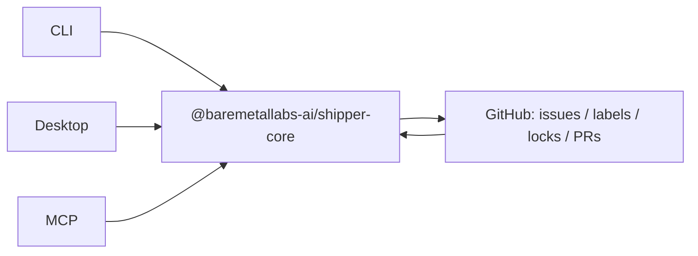

Shipper exposes one GitHub-backed workflow through three entry points: the CLI, the desktop app, and
the MCP server. This page explains the runtime boundaries and shared state model behind those entry
points; command usage, desktop walkthroughs, and MCP client setup live in the task-focused guides and
reference pages.

## Shared model

Shipper exposes one GitHub-backed workflow through the CLI, Desktop, and MCP, and all three call
shared core helpers instead of carrying separate workflow logic. That shared model stores workflow
state in GitHub labels, uses the `shipper:locked` label for locks, and writes stage outcomes through
the verdict-based [Protocol](/concepts/protocol/) result contract. `shipper:locked` lives in GitHub
issue state rather than local process state, so another process or entry point sees the same lock.
Configuration is shared through [Settings](/reference/settings/) at `.shipper/settings.json`, while
repo-local artifacts and prompt overrides are documented in the
[.shipper directory](/reference/shipper-directory/). Bundled prompts live under
`packages/core/src/prompts/<agent>/`, and stage work runs in ephemeral worktrees stored in
`~/.shipper/worktrees/` so entry points reuse the same prompt, worktree, GitHub, and result
machinery.

## CLI

The CLI runtime starts in command modules under `packages/cli/src/commands/<name>.ts`. Each command
validates input, performs the needed prerequisites or issue selection, and then either runs
command-local orchestration or calls shared helpers from `packages/core`.

Prompt-driven stages cross into core at `runPrompt()` in
`packages/core/src/lib/prompt-runner.ts`. That boundary resolves repo-local overrides at
`.shipper/prompts/<agent>/<name>.md` before bundled prompts under
`packages/core/src/prompts/<agent>/<name>.md`, appends requested issue or PR context, and spawns the
configured agent CLI.

The `new`, `groom`, `design`, `plan`, `implement`, and PR commands run in fresh ephemeral worktrees.
`withWorktree()` in `packages/core/src/lib/worktree.ts` handles creation, callback execution, and
cleanup under `~/.shipper/worktrees/`. The stage runs from the configured base branch or PR branch so
the agent does not operate in the caller's dirty checkout.

`shipper next` and sequential `shipper ship` dispatch the next stage in-process through
`packages/cli/src/commands/stage-dispatch.ts`. Parallel
`shipper ship --auto --parallel <n>` uses `packages/cli/src/commands/ship-auto.ts` to fork
`packages/cli/src/ship-worker.ts`, with the parent and worker exchanging one run message plus one
result message over IPC for each isolated job.

All GitHub interaction goes through the `gh` CLI. Structured `gh --json` payloads are checked through
`packages/core/src/lib/gh-schemas.ts` and `packages/core/src/lib/gh-json.ts` so command code works
with parsed shapes instead of unchecked JSON.

## Desktop

The desktop app is an Electron runtime split between renderer code, the preload bridge, and the main
process. Renderer code calls the preload API exposed by `packages/desktop/src/preload/index.ts`, and
the main process handles those calls through `ipcMain.handle(...)` handlers under
`packages/desktop/src/main/handlers/`.

Stage work is delegated by the main process to Node CLI subprocesses rather than reimplemented in
renderer code. `packages/desktop/src/main/handlers/background.ts` prepares repositories with core
helpers such as `ensureRepoClone`, then asks `BackgroundManager` to spawn `shipper new`,
`shipper ship`, `shipper init`, and `shipper unblock` with the needed headless arguments. Those
subprocesses land on the same `packages/core` prompt, worktree, lock, and result-protocol paths used
by terminal commands.

The desktop runtime also uses filesystem-based IPC for the flows that need process-to-process
coordination beyond stdout and stderr. Interactive groom creates a temporary control directory,
passes it as `SHIPPER_DESKTOP_CONTROL_DIR`, writes `state.json`, and watches for the
`finalize-requested` sentinel through `packages/core/src/lib/desktop-control.ts` and
`packages/core/src/lib/prompt-runner.ts`. Background ship halt signaling passes
`SHIPPER_PAUSE_SENTINEL_FILE`; the value is a per-session file path under the Electron user-data
`pause-sentinels` directory, and the file's presence is the signal.

Desktop distribution is currently unsigned macOS arm64 only; see the
[Desktop install guide](/guides/desktop/#install) for current distribution status.

## MCP

The MCP server uses stdio transport only, reserves stdout for MCP protocol messages, and routes
ordinary logs to stderr. At startup, `createServer()` calls `resolveAndEnterRepoDir()` once before
tools are registered. `SHIPPER_REPO_DIR` is resolved relative to the startup working directory when
set; otherwise the startup working directory is used, and the process changes into that repository
for the lifetime of the server.

Tool registration builds one documentation corpus context with `buildDocsCorpus()` in
`packages/mcp/src/docs/corpus.ts`. `resolveDocsCorpusRoot()` first looks for workspace docs, then
bundled docs, then an absolute `SHIPPER_DOCS_PATH` fallback. The
[Environment variables](/reference/environment-variables/) reference owns details for
`SHIPPER_REPO_DIR`, `SHIPPER_DOCS_PATH`, and the desktop control variables.

The tools in `packages/mcp/src/tools.ts` fall into three implementation classes. Direct
GitHub-backed helpers call core `gh` utilities without spawning `shipper`, including
`shipper_list_issues`, `shipper_get_issue`, `shipper_get_pr_checks`, `shipper_adopt`, and
`shipper_unlock`. Direct in-process helpers include `shipper_docs_search`, `shipper_docs_get`,
`shipper_reset` via `executeReset`, and `shipper_answer_question` for resuming pending headless
sessions. Workflow-changing tools spawn CLI subprocesses: `shipper_advance`, experimental
`shipper_groom`, `shipper_create_issue`, and `shipper_unblock` use headless mode for agent-backed
work, while `shipper_merge` runs `shipper merge --once` for ready PRs. The
[MCP reference](/reference/mcp/) owns the per-tool surface, while [MCP setup](/guides/mcp-setup/)
owns client setup.

## Workflow state

Workflow state is represented by GitHub labels, with the normal stage sequence
`shipper:new -> shipper:groomed -> shipper:designed -> shipper:planned -> shipper:implemented -> shipper:pr-open -> shipper:pr-reviewed -> shipper:ready`.
The [State Machine](/concepts/state-machine/) page owns the full transition table, but every entry
point reads the same labels before deciding what work can run next. Priority labels affect auto-ship
ordering.

Control labels change selection and safety behavior across the whole workflow. `shipper:blocked`
prevents normal advancement except the allowed new-to-groomed path, `shipper:locked` prevents
concurrent workflow access, and `shipper:failed` blocks `next` and auto-selection until reset or
recovery.

Locks are GitHub label state, not local mutexes. Acquiring a lock adds `shipper:locked`, stale
detection reads the last GitHub timeline `shipper:locked` label event and compares it with
`lockTimeoutMinutes`, and heartbeat renewal runs every `lockTimeoutMinutes / 3`. Releasing the lock
removes the label during normal cleanup, with best-effort cleanup also attempted during process
shutdown.

Stage output is reduced to a verdict described by the [Protocol](/concepts/protocol/). `accept`
advances to the next state, `reject` rolls back according to the transition table, and `fail` or a
crash terminates the run as a failure.
