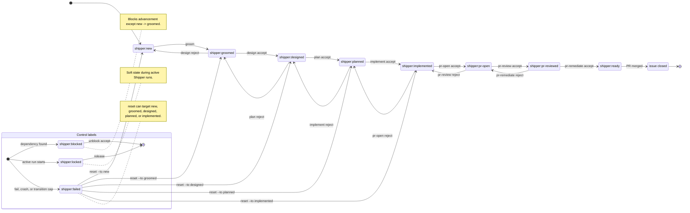

Shipper uses GitHub issue labels as the sole representation of workflow state. Each issue carries
exactly one `shipper:*` workflow label at a time, plus zero or more control and priority labels.

## Labels

### Workflow labels

| Label                 | Description                             |
| --------------------- | --------------------------------------- |
| `shipper:new`         | New issue, awaiting grooming            |
| `shipper:groomed`     | Product-groomed, awaiting design        |
| `shipper:designed`    | Design-reviewed, awaiting planning      |
| `shipper:planned`     | Implementation planned, awaiting coding |
| `shipper:implemented` | Implementation complete, awaiting PR    |
| `shipper:pr-open`     | PR opened, awaiting review              |
| `shipper:pr-reviewed` | PR reviewed, awaiting remediation       |
| `shipper:ready`       | Ready for final review and merge        |

### Control labels

| Label             | Description                                                                                |
| ----------------- | ------------------------------------------------------------------------------------------ |
| `shipper:blocked` | Issue has unmet dependencies. Prevents advancement (except `new` -> `groomed`).            |
| `shipper:locked`  | Active shipper instance is working on this issue. Prevents concurrent access.              |
| `shipper:failed`  | Automated processing failed. Blocks `next` and auto-selection. Cleared by `shipper reset`. |

### Priority labels

| Label                   | Description                                        |
| ----------------------- | -------------------------------------------------- |
| `shipper:priority-high` | High-priority issue. Processed first by auto-ship. |
| `shipper:priority-low`  | Low-priority issue. Processed last by auto-ship.   |

Normal priority is the default when neither label is present.

## State transitions



### How transitions happen

For result-protocol stages after grooming, labels are transitioned by Shipper from the agent's
result file. The agent writes `result.json`; Shipper resolves the verdict to a label transition and
runs `gh issue edit` with every `--add-label` and `--remove-label` argument in one atomic call. For
example, after a successful design:

```bash
gh issue edit <ISSUE> --add-label "shipper:designed" --remove-label "shipper:groomed"
```

`shipper new` and grooming still perform prompt-owned GitHub mutations such as issue creation,
issue-body edits, comments, and the initial `shipper:new` / `shipper:groomed` labels. The
result-file transition contract owns the downstream workflow stages.

### Rollback paths

A `reject` verdict rolls back to an earlier stage if the work is insufficient:

| Stage        | Can roll back to      |
| ------------ | --------------------- |
| design       | `shipper:new`         |
| plan         | `shipper:groomed`     |
| implement    | `shipper:designed`    |
| pr-open      | `shipper:planned`     |
| pr-review    | `shipper:implemented` |
| pr-remediate | `shipper:pr-open`     |

### Reject is an interior event

`shipper ship <issue>`, `shipper ship --auto`, and `shipper next` treat a stage `reject` verdict as
an orderly rollback, not as a terminal command failure. After Shipper applies the rollback label
transition from the result file, the ship loop re-reads that label and continues from the
corresponding stage.

The existing safety rails still apply:

- Every forward or backward label change counts toward the per-run transition cap
  (`MAX_TRANSITIONS = 15`). Hitting the cap still relabels the issue `shipper:failed`.
- If a reject does not produce an observable workflow-label move, the run still aborts to avoid an
  infinite loop.
- Crashes (no verdict) and explicit `fail` verdicts are still terminal failures.

Rolling back to `shipper:new` is the one special case:

- Single-issue `shipper ship <issue>` stops before running interactive `groom`, leaves the issue at
  `shipper:new`, logs that grooming is required, and exits zero.
- `shipper ship --auto` still records that issue as a failure and adds it to the in-run skip set,
  because `shipper:new` is not an auto-ship candidate.

## The `next` command

Auto-advances an issue by reading its current label and dispatching to the corresponding stage
through the shared in-process dispatcher. `next` validates that exactly one workflow label is present,
rejects issues marked `shipper:failed`, and refuses blocked issues except `shipper:new`, which can
always be groomed. If the dispatched stage rejects, `next` logs the rolled-back label and exits zero.
Crashes and explicit `fail` verdicts still exit non-zero.

## The `ship --auto` command

Processes issues in priority order. Auto-ship chooses the highest-priority available issue first,
then prefers the most-complete stage within the same priority tier:

```text
shipper:ready > shipper:pr-reviewed > shipper:pr-open > shipper:implemented
> shipper:planned > shipper:designed > shipper:groomed
```

`shipper:new` is excluded from auto-ship because grooming is interactive by default.

Issues are ordered by priority first: `shipper:priority-high`, then normal priority, then
`shipper:priority-low`. Within the same priority tier, auto-ship prefers the most-complete stage
using the ordering above. Within the same stage and priority tier, issues are processed FIFO by
label-application timestamp queried via the GitHub timeline API.

After exhausting available issues, auto-ship attempts to unblock `shipper:blocked` issues. If any
are unblocked, it loops back to process the newly available issues.

Sequential auto-ship and single-issue `shipper ship <issue>` runs execute stages in-process through
the same dispatcher that powers `shipper next`. Parallel auto-ship keeps one OS process per active
issue for fault isolation and communicates with each worker through a small fork/IPC protocol.

A non-NEW reject stays inside that per-issue ship loop. Auto-ship only records a failure when the run
ends in a terminal error, such as a crash, an explicit `fail`, transition-cap exhaustion, or a reject
that rolls the issue back to `shipper:new`.

The shared per-run transition cap (`MAX_TRANSITIONS = 15`) prevents infinite loops, including tight
`pr-reviewed <-> pr-remediate` reject/resume cycles.

## The `reset` command

`reset` only moves an issue backward to an earlier workflow stage.

- Without `--to`, it presents an interactive picker of valid earlier targets.
- With `--to <stage>`, it resets directly to the specified earlier stage.
- Valid reset targets are `new`, `groomed`, `designed`, `planned`, and `implemented`, as long as the
  target is behind the current stage.
- Reset removes later shipper labels, closes matching open PRs, and for any closed PR whose head ref
  starts with `shipper/` attempts to delete that remote branch; it also removes matching local
  branches and local worktrees, deletes later-stage issue comments, and posts a reset notice comment
  after re-applying the target label.
- Reset always removes `shipper:failed`.
- Reset preserves `shipper:priority-high` and `shipper:priority-low`.

## Locking

The `shipper:locked` label prevents concurrent execution on the same issue.

- **Acquire:** Adds the label. If it is already present and stale according to `lockTimeoutMinutes`
  (default `30` minutes), Shipper clears and reacquires it. If the lock is still fresh, the command
  errors out.
- **Heartbeat:** Renews the lock every `lockTimeoutMinutes / 3` minutes. With the default timeout,
  that is every 10 minutes.
- **Release:** Removes the label in a `finally` block after command completion. Signal handlers
  (`SIGINT` and `SIGTERM`) also release the lock.
- **Staleness detection:** Queries the issue timeline API for the most recent `labeled` event for
  `shipper:locked` and compares its age to the configured timeout.

All workflow commands wrap their execution in `withIssueLock()`.

## Blocking

`shipper:blocked` indicates an issue has unmet dependencies. It is typically set by the agent during
grooming when dependencies are discovered.

- The `next` command refuses to advance blocked issues, except `shipper:new`.
- `selectIssuesForStage()` excludes blocked issues from auto-selection, except for `shipper:new`.
- The `unblock` command prompts an agent to re-check dependencies and remove the label if resolved.

## Key files

| File                                          | Role                                            |
| --------------------------------------------- | ----------------------------------------------- |
| `packages/core/src/lib/labels.ts`             | Label definitions (names, colors, descriptions) |
| `packages/cli/src/commands/stage-dispatch.ts` | Shared in-process stage dispatch                |
| `packages/cli/src/commands/next.ts`           | `next` validation and lock-wrapped dispatch     |
| `packages/cli/src/commands/ship-execute.ts`   | Single-issue ship loop and stage progression    |
| `packages/cli/src/commands/ship-auto.ts`      | Sequential and parallel auto-ship orchestration |
| `packages/cli/src/ship-worker.ts`             | Parallel worker IPC entry                       |
| `packages/cli/src/commands/reset.ts`          | Stage categorization and cleanup for reset      |
| `packages/cli/src/commands/issue-list.ts`     | Label display and grouping                      |
| `packages/core/src/lib/lock.ts`               | Lock acquire, release, heartbeat, and staleness |
| `packages/core/src/lib/github.ts`             | Issue selection and label timeline queries      |
| `packages/core/src/lib/prerequisites.ts`      | Label existence validation                      |
